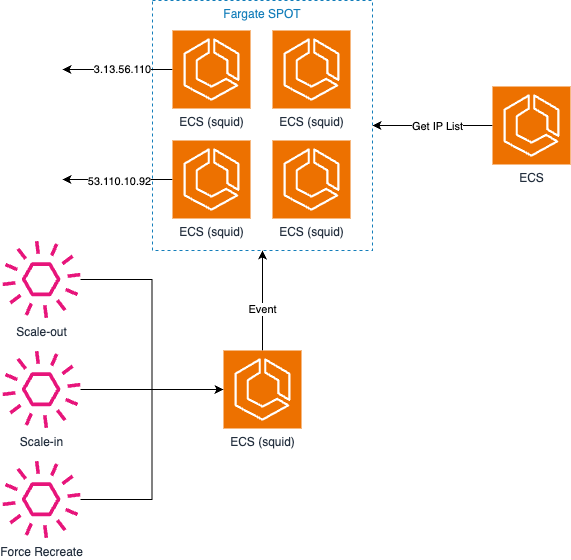

# ECS Proxy Architecture



## Folder Architecture

```
    |- apis
        |- gateway
        |- squid
    |- infra
        |- alb
        |- config
        |- ecs-gateway
        |- ecs-squid
```

## Desc

- Squid 서버를 사용하여 IP 우회
- Squid 서버는 ECS Fargate + Public IP를 활용하여 실행
- Squid Server 들의 IP List들을 Gateway 서버에서 관리 (/ip)
- Event를 사용하여 Squid Server 의 Scale In / Out, Recreate 를 관리
